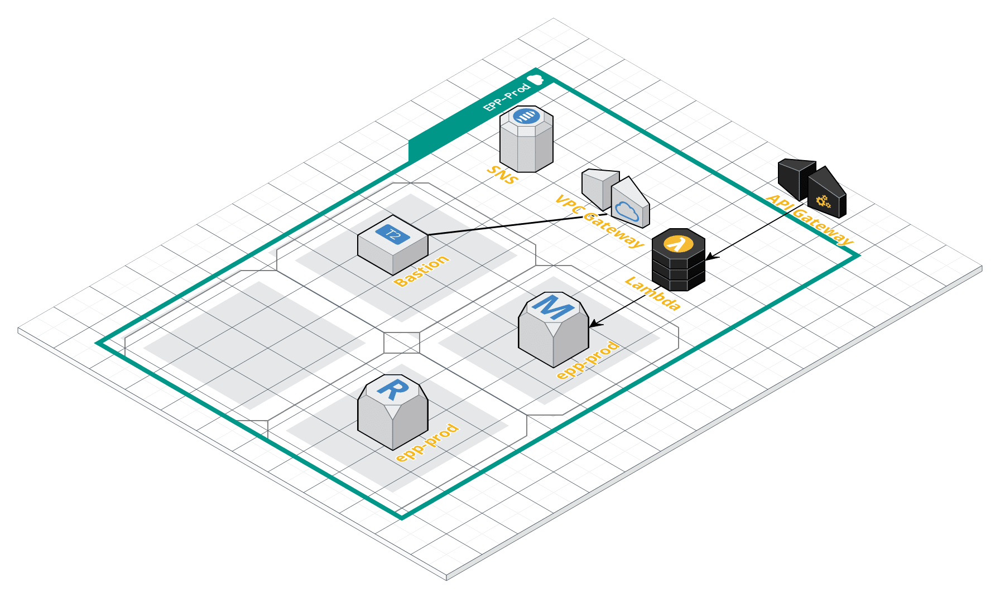

<!--
title: 'AWS Serverless REST API - EPP'
description: 'RESTful Web Service allowing you to retrieve EPP data from the database. PostgreSQL is used to store the data.'
layout: Doc
framework: v1
platform: AWS
language: nodeJS
authorLink: '[https://github.com/asmajlovicmars](https://github.com/asmajlovicmars)'
authorName: 'Adnan Smajlovic'
authorAvatar: '[https://avatars3.githubusercontent.com/u/29715259?s=460&v=4](https://avatars3.githubusercontent.com/u/29715259?s=460&v=4)'
-->
# Serverless REST API

[RESTful Web Services](https://en.wikipedia.org/wiki/Representational_state_transfer#Applied_to_web_services).

## Structure
All resources were created via Terraform scripts to create the sample architecture below. This includes the VPC, PostgreSQL, SNS topics, KMS and EC2 Bastion host.  The API is created using the [Serverless](./docs/epp.md) framework which will deploy all AWS lambda functions and API gateway. Database credentials are encrypted by KMS and placed in a secrets file along with VPC id, subnet ids, SNS topics and bastion hostname required for serverless deployment.  Secrets file must be named secrets.environment.yml.  (ex. secrets.dev.yml)

#### Example Architecture


## Use-cases

- API for a Web and Mobile Application

## Setup

Install Serverless
```bash
npm install -g serverless
```

Install required node modules
```bash
npm install
```

## Deploy

In order to deploy the endpoint simply run

```bash
⚡ serverless deploy
⚡ AWS_PROFILE=changeme-to-awsprofile-name sls deploy --stage dev -v
```

The expected result should be similar to:

```bash
Serverless: Packaging service...
Serverless: Excluding development dependencies...
Serverless: Uploading CloudFormation file to S3...
Serverless: Uploading artifacts...
Serverless: Uploading service epp-api.zip file to S3 (18.72 MB)...
Serverless: Validating template...
Serverless: Updating Stack...
Serverless: Checking Stack update progress...
........................................
Serverless: Stack update finished...
Service Information
service: epp-api
stage: dev
region: us-east-1
stack: epp-api-dev
resources: 92
api keys:
  dev-epp-rest-api-key: awsgeneratedapikey
endpoints:
  GET - https://someid.execute-api.us-east-1.amazonaws.com/dev/occupation
  GET - https://someid.execute-api.us-east-1.amazonaws.com/dev/occupation/{id}
  GET - https://someid.execute-api.us-east-1.amazonaws.com/dev/occupation/attribute/{id}
  GET - https://someid.execute-api.us-east-1.amazonaws.com/dev/occupation/distance/{id}
  GET - https://someid.execute-api.us-east-1.amazonaws.com/dev/synch-occupations
  GET - https://someid.execute-api.us-east-1.amazonaws.com/dev/synch-skills
  GET - https://someid.execute-api.us-east-1.amazonaws.com/dev/synch-abilities
  GET - https://someid.execute-api.us-east-1.amazonaws.com/dev/redis/occupation
  GET - https://someid.execute-api.us-east-1.amazonaws.com/dev/redis/occupation/{id}
functions:
  listoccupations: epp-api-dev-listoccupations
  getoccupation: epp-api-dev-getoccupation
  getoccupationattribute: epp-api-dev-getoccupationattribute
  getoccupationdistance: epp-api-dev-getoccupationdistance
  synchoccupations: epp-api-dev-synchoccupations
  synchskills: epp-api-dev-synchskills
  synchabilities: epp-api-dev-synchabilities
  dispatcher-occupations: epp-api-dev-dispatcher-occupations
  dispatcher-skills: epp-api-dev-dispatcher-skills
  dispatcher-abilities: epp-api-dev-dispatcher-abilities
  dispatcher-warm-list: epp-api-dev-dispatcher-warm-list
  dispatcher-warm-get-occ: epp-api-dev-dispatcher-warm-get-occ
  cron-synch: epp-api-dev-cron-synch
  cron-warm: epp-api-dev-cron-warm
  listredis: epp-api-dev-listredis
  getdetails: epp-api-dev-getdetails
layers:
  None
Serverless: Removing old service artifacts from S3...
```

### AWS Lambda

By default, AWS Lambda limits the total concurrent executions across all functions within a given region to 100. The default limit is a safety limit that protects you from costs due to potential runaway or recursive functions during initial development and testing. To increase this limit above the default, follow the steps in [To request a limit increase for concurrent executions](http://docs.aws.amazon.com/lambda/latest/dg/concurrent-executions.html#increase-concurrent-executions-limit).
